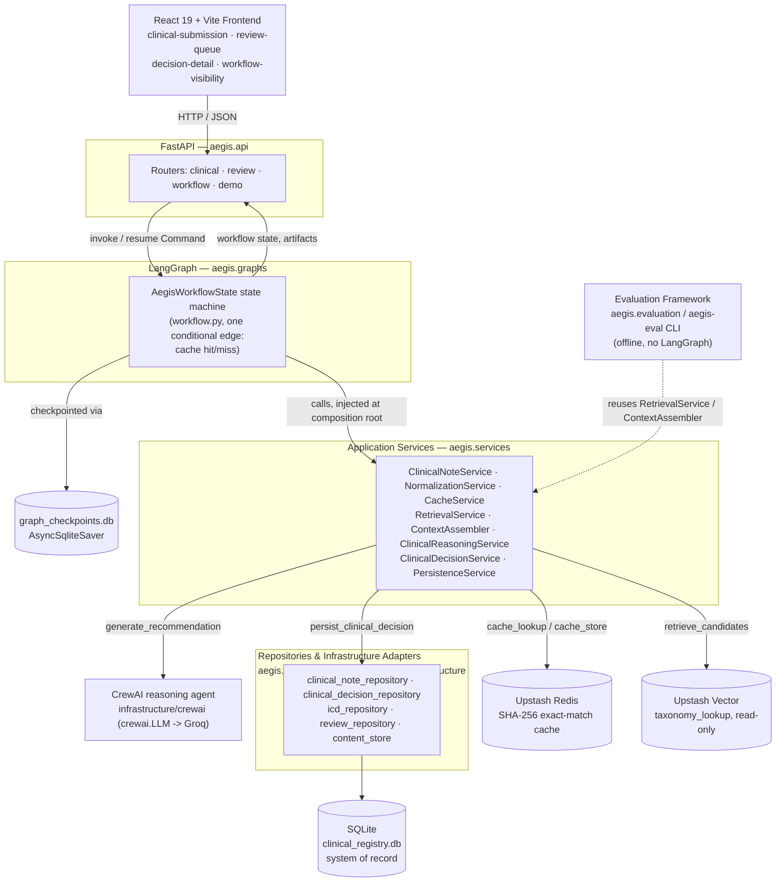
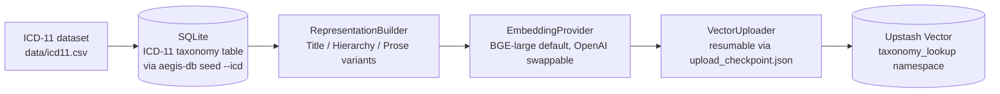
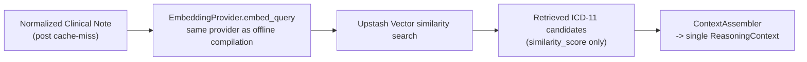
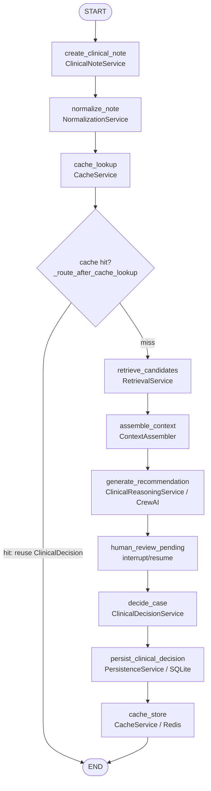

# aegis-clinical 🛡️

## Repository Guide

- 🚀 [10-minute demonstration walkthrough](docs/demo.md)
- 🏗️ [Architecture deep dive](docs/architecture.md)
- 🔄 [LangGraph orchestration model](docs/orchestration.md)
- ⚖️ [Tradeoffs and limitations](docs/tradeoffs_and_limitations.md)
- 📐 [Architecture Decision Records](docs/adr/)
- 🧪 [Testing and evaluation methodology](docs/testing_and_evaluations.md)

## Deterministic AI Orchestration for Clinical Note Structuring

`aegis-clinical` is a reference architecture demonstrating how modern AI systems can safely transform unstructured clinical notes into structured ICD-11 classifications through deterministic workflow orchestration, semantic retrieval, and human-in-the-loop validation.

Rather than relying on autonomous agent loops, the system combines explicit state-machine orchestration with bounded AI reasoning to ensure every clinical note follows a deterministic execution path from ingestion through physician approval. The repository emphasizes architectural correctness, clear data ownership, reproducible execution, and evaluation-driven development over infrastructure scale.

> **The defining principle, enforced in code, not just in this document:**
> Deterministic systems own workflow execution. Probabilistic systems (LLMs) contribute
> bounded reasoning inside explicit guardrails. **The application governs the AI; the AI
> never owns the application.** See [ADR-0001](docs/adr/0001-deterministic-orchestration-around-probabilistic-reasoning.md)
> for the reasoning and the alternatives it rules out.

Concretely, that principle is implemented as three subsystems with a hard boundary between them — see `docs/architecture.md` for the full depth, and the diagrams below for the two that matter most at runtime:

1. **Offline knowledge compilation** (`indexing/`, `embeddings/`, `vectorstores/`, `jobs/`) — deterministic, reproducible, and run only when the ICD-11 taxonomy changes. Never shares a code path with runtime retrieval.
2. **Deterministic runtime preparation** (`retrieval/`, early LangGraph nodes) — anonymize, normalize, hash, cache-lookup, embed, and semantically search; no LLM involved, and every step is unit-testable in isolation.
3. **Bounded AI reasoning** (`agents/`, `schemas/`, `graphs/`) — a single CrewAI agent reasons over a fixed `ReasoningContext` and returns a schema-validated `CodingRecommendation` it cannot use to invent an ICD-11 code retrieval never surfaced.

> **New here?** `docs/demo.md` is a guided, ~10-minute walkthrough of this exact repository — start there for a live-demo tour instead of reading top to bottom.

---

# System Architecture

Every request flows through one deterministic path, top to bottom. Upstash Vector, Upstash Redis, and CrewAI are the only components that hold non-deterministic or externally-hosted state, and each is reached exclusively through an application service — never directly from the graph or the frontend.



*Source: [`system_architecture.mmd`](system_architecture.mmd). Application services are the only layer LangGraph calls directly; services are the only layer that talks to CrewAI, repositories, Redis, or Vector — the graph itself has no infrastructure imports.*

---

# Architectural Overview

The application is intentionally organized around clear responsibility boundaries, where every major component owns exactly one concern.

### LangGraph — Deterministic Workflow Orchestration

LangGraph acts as the macro-orchestrator of the application. It defines the immutable execution topology responsible for sequencing data anonymization, semantic retrieval, AI-assisted reasoning, physician review, persistence, and workflow resumption. Human-in-the-Loop (HITL) checkpoints suspend execution safely until physician approval before allowing downstream state transitions.

### CrewAI — Bounded Clinical Reasoning

CrewAI encapsulates the clinical reasoning boundary. The v1 implementation intentionally uses a **single specialist reasoning agent** that interprets the anonymized note against the semantically retrieved ICD-11 candidates and produces a structured coding recommendation. The point of the boundary is not agent count — it is to keep reasoning cleanly separable from orchestration, so additional specialist agents (symptom extraction, negation/context analysis, temporal reasoning) can be added later without touching the LangGraph state machine. Agent execution stays isolated inside deterministic workflow boundaries and never controls application flow. See `docs/crewAI_architectural_decision.md`.

### Pydantic — Structured Validation Boundary

All AI-generated outputs pass through strongly typed **Pydantic** models before entering the application domain. This boundary converts probabilistic language-model responses into deterministic application objects while rejecting malformed, incomplete, or semantically invalid outputs before they reach persistence layers.

> **Future v2 exploration:** [PydanticAI](https://ai.pydantic.dev/) may be introduced for stronger typed agent/tool boundaries and structured agent execution. It is a declared dependency but is **not currently integrated** — v1 validation is plain Pydantic, and CrewAI remains the reasoning boundary. This is a future architectural evaluation, not a planned replacement of CrewAI.

---

# Storage Architecture

The persistence layer follows a strict separation of responsibilities: **SQLite is the only
authoritative store; everything else is a derived, disposable optimization layer that could
be wiped and rebuilt from SQLite (and the ICD-11 source dataset) without losing clinical
truth.** That asymmetry — not just "three data stores" — is the actual design:

| Store          | Responsibility                                       | Authoritative |
| -------------- | ------------------------------------------------------ | :-: |
| SQLite         | Clinical registry + ICD-11 taxonomy (system of record) | **Yes** |
| Upstash Vector | Semantic nearest-neighbor retrieval (ids only)          | No — derived |
| Upstash Redis  | Deterministic SHA-256 exact-match cache                 | No — derived |

### SQLite — System of Record

SQLite serves as the authoritative source of truth for all mutable application state, including clinical cases, physician-approved ICD-11 classifications, audit history, workflow checkpoints, optimistic versioning, and the complete ICD-11 taxonomy. Write-Ahead Logging (WAL) mode enables concurrent reads while preserving transactional consistency. Every write to Redis or Upstash Vector is downstream of something SQLite already durably persisted — persistence always happens first (see "Clinical Processing Pipeline" below) — so neither derived store can ever hold clinical truth SQLite doesn't also have.

### Upstash Vector — Semantic Retrieval (Derived)

A single Upstash Vector index contains a read-only `taxonomy_lookup` namespace populated with precomputed embeddings of the official ICD-11 taxonomy. The current default embedding provider is **SentenceTransformers `BAAI/bge-large-en-v1.5` (1024-dimensional)**; because embedding providers sit behind a swappable interface (`src/aegis/embeddings/`), OpenAI's `text-embedding-3-small` (1536-dimensional) can be selected instead via `EMBEDDING_*` settings without changing retrieval logic.

The vector database functions exclusively as a semantic nearest-neighbor index, returning ICD-11 identifiers during similarity search. Clinical descriptions, taxonomy metadata, and application state remain solely within SQLite, following a pointer-based architecture that avoids duplicated mutable data across storage systems. It is derived, not authoritative, precisely because it is an index *over* SQLite's taxonomy: the `demo-local` profile proves this in practice by replacing it with a locally compiled equivalent (see "Runtime Execution Profiles" below) without changing what gets persisted or how.

### Upstash Redis — Deterministic Cache (Derived)

Redis provides an exact-match cache keyed by the SHA-256 hash of normalized clinical notes. Previously processed notes bypass semantic retrieval and AI reasoning entirely, returning physician-approved ICD-11 classifications with zero additional embedding generation or LLM inference cost. This deterministic cache improves efficiency over time while preserving SQLite as the authoritative data source — a cold or wiped Redis instance never loses a clinical decision, it only loses the shortcut to one already durably persisted in SQLite.

---

# Retrieval: Offline Compilation vs. Runtime Inference

The ICD-11 vector index and a per-request retrieval call are two independent processes that never run in the same code path — deliberately, so that reindexing the taxonomy can never block or slow down a live clinical request.

**Offline — runs only when the ICD-11 taxonomy changes:**



**Runtime — runs on every cache-miss request:**



*Sources: [`offline_indexing_pipeline.mmd`](offline_indexing_pipeline.mmd), [`runtime_retrieval_pipeline.mmd`](runtime_retrieval_pipeline.mmd). Both stages share one `EmbeddingProvider` abstraction so the two embedding spaces are always compatible — but the runtime path only ever queries the index; it never writes to it. There is no vector write-back of clinical notes in v1 (see `docs/tradeoffs_and_limitations.md`).*

---

# Clinical Processing Pipeline

Every clinical note progresses through a deterministic execution pipeline. This is the actual LangGraph state machine (`src/aegis/graphs/workflow.py`) — the only conditional edge is the cache hit/miss route; everything else is a fixed sequence of application-service calls:



*Source: [`workflow_state_machine.mmd`](workflow_state_machine.mmd), kept in lockstep with `workflow.py` — see `docs/orchestration.md` for what each node does and does not own.*

1. PHI anonymization and normalization.
2. Deterministic Redis cache lookup using the normalized note hash.
3. Semantic retrieval of candidate ICD-11 codes from Upstash Vector upon cache miss.
4. Bounded AI-assisted reasoning through a single CrewAI clinical reasoning agent, with all output validated by Pydantic schemas before it can reach persistence.
5. Human-in-the-Loop physician approval — the workflow suspends at `human_review_pending` until a decision is submitted.
6. Transactional persistence into SQLite, followed by a Redis cache update — in that order, so only durably persisted clinical truth ever becomes reusable cached knowledge.

This architecture intentionally combines deterministic state transitions with bounded AI reasoning, ensuring that probabilistic model outputs never directly control workflow execution.

---

# Repository Structure

```text
aegis-clinical/
├── data/                        # ICD-11 CSV, seeded SQLite DBs, fixtures
├── docs/                        # Reader-facing architecture docs (+ docs/history/)
├── evals/                       # AI-quality eval dataset + harness (clinical_cases.jsonl)
├── config/                      # evaluation.yaml / evaluation.production.yaml
├── runtime_domain_contracts/    # Authoritative runtime domain contracts
├── application_service_contracts/  # Authoritative application service contracts
├── frontend/                    # React 19 + Vite physician dashboard (feature-based)
├── src/
│   └── aegis/
│       ├── agents/              # CrewAI reasoning agent(s)
│       ├── api/                 # FastAPI app, routers, bootstrap composition root
│       ├── database/            # SQLite migrations, connection, repositories, CLI
│       ├── embeddings/          # Swappable embedding providers (BGE / OpenAI)
│       ├── vectorstores/        # Vector store abstraction (local / Upstash)
│       ├── indexing/            # Offline knowledge-compilation pipeline (Phase 1)
│       ├── retrieval/           # Runtime retrieval preparation (Phase 2)
│       ├── services/            # Deterministic application services
│       ├── graphs/              # LangGraph workflow, nodes, state, checkpointing
│       ├── schemas/             # Pydantic structured-output validation
│       ├── prompts/             # Versioned reasoning prompt assets
│       ├── evaluation/          # Custom deterministic eval framework (aegis-eval)
│       └── infrastructure/      # SQLite / Redis / CrewAI adapters
├── tests/                       # Deterministic software-correctness tests
├── pyproject.toml
└── README.md
```

> Note: `.github/workflows/lint_and_typecheck.yml` exists but is currently empty — CI is not yet enforcing the quality gate. The `providers/` package is an orphaned earlier LLM-provider abstraction with no current callers.

---

# Verification Strategy

The repository distinguishes functional correctness from AI quality evaluation.

## Unit Tests

Verify deterministic business logic, schema validation, state transitions, and utility functions independent of external AI providers.

## Integration Tests

Validate complete workflow execution across orchestration, persistence, checkpointing, and Human-in-the-Loop interactions using synthetic datasets.

## Evaluation Framework

AI-quality evaluation is maintained independently from traditional software tests. AEGIS ships a **custom deterministic evaluation framework** (`src/aegis/evaluation/`, CLI: `aegis-eval`, dataset: `evals/clinical_cases.jsonl`, config-driven via `config/evaluation.yaml`) that reuses the same real application services the production workflow uses. It measures two boundaries:

- **Retrieval quality** — Recall@K, Hit Rate@K, and Mean Reciprocal Rank against a curated ICD-11 fixture (`local`) or the real Upstash Vector index (`production`).
- **Reasoning quality** — deterministic scoring only (no LLM-as-judge yet): schema validity, expected-code alignment, and evidence grounding.

Every run writes reproducible, provenance-stamped reports (git commit, dataset hash, config hash, model/provider) under `.artifacts/evaluations/`. See `docs/testing_and_evaluations.md` for the full methodology and the deferred roadmap (LLM-as-judge, Braintrust experiment tracking — both future, not yet integrated).

---

# Runtime Execution Profiles

> For a guided, narrated walkthrough of the `demo-local`/`demo` path (plus the frontend and the evaluation CLI), see `docs/demo.md`. For the architectural reasoning behind profiles as a mechanism, see [ADR-0002](docs/adr/0002-runtime-profile-architecture.md); for why `demo-local` specifically compiles a real local index rather than faking retrieval, see [ADR-0003](docs/adr/0003-local-demo-execution-strategy.md).

A single configuration value, `AEGIS_PROFILE`, selects **which infrastructure is real** for a
given run — never which application code runs. The FastAPI app, routers, LangGraph workflow,
and every application service are constructed identically in all four profiles; only the
composition root (`aegis/api/bootstrap.py`) decides which concrete adapter backs the cache,
the reasoning boundary, the content repository, and (for `demo-local` only) vector retrieval.
The four profiles below are ordered deliberately, from **zero credentials** to **full
deployment** — each one adds back exactly one more piece of real managed infrastructure than
the last, so the progression itself demonstrates the dependency-inversion boundary rather than
just asserting it:

| Profile | Vector retrieval | Cache | Reasoning | Credentials needed |
| --- | --- | --- | --- | --- |
| **`demo-local`** | Local, compiled index | In-memory | Deterministic | *none* |
| **`demo`** | Real Upstash Vector | In-memory | Deterministic | Upstash Vector + embedding |
| **`integration`** | Real Upstash Vector | Real Upstash Redis | Real CrewAI/Groq | all of the above + Groq + Redis |
| **`production`** | Real Upstash Vector | Real Upstash Redis | Real CrewAI/Groq | same as integration |

### 1. `demo-local` — zero credentials

The entry point for a reviewer who has just cloned the repository and has no managed-service
credentials at all:

```bash
uv sync
make db-init && make db-seed-icd
make demo-local
# equivalent to: AEGIS_PROFILE=demo-local uv run uvicorn aegis.api.main:app --app-dir src --reload --port 9000
```

`AEGIS_PROFILE=demo-local` uses the same in-memory cache, reasoning, and content-repository substitutes as `demo` below, and additionally replaces retrieval itself: instead of querying a live Upstash Vector index, `aegis.indexing.local_compiler` compiles the real ~15,471-row ICD-11 taxonomy (the same rows `make db-seed-icd` seeds, not a toy fixture) through the same offline `IndexingPipeline`/`RepresentationBuilder` used to build the real index, embeds it locally with the same `SentenceTransformers` model (`BAAI/bge-large-en-v1.5`) every other profile defaults to, and serves queries from an in-memory `LocalVectorQueryProvider` running brute-force cosine similarity. Retrieval is therefore still real semantic search over the real taxonomy — never a hardcoded ICD code — just against a local index instead of Upstash's.

**First run compiles the local index; every run after that loads it from a cache.** Embedding ~15k rows on CPU is a one-time cost of a few minutes; the compiled result is persisted as a generated artifact under `.artifacts/local_vector_index/` (already `.gitignore`d, never committed), fingerprinted by a manifest (taxonomy content hash, row count, embedding model, dimensions) so any change to the taxonomy or embedding configuration triggers a fresh compile rather than silently serving a stale index. `--reload` restarts and subsequent `make demo-local` invocations load that cached artifact in seconds.

`demo-local` is a reviewer-convenience path for exercising the architecture with nothing installed beyond `uv sync`, not a claim that its retrieval quality or performance matches the profiles below — the brute-force local query path is appropriate for a single reviewer's local index, not a production-scale deployment (see ADR-0003's Consequences).

### 2. `demo` — real retrieval, minimal credentials

The next step up trades the local index for the real one, at the cost of two credential pairs:

```bash
make db-init && make db-seed-icd   # once, before the first run
make demo
# equivalent to: AEGIS_PROFILE=demo uv run python scripts/demo_e2e.py
```

This drives the real FastAPI application (`aegis.api.main.app`) through its HTTP boundary using FastAPI's `TestClient` — the real lifespan, the real LangGraph workflow, and the real interrupt/resume suspension all run exactly as they would under a live server, against the same composition root (`aegis/api/bootstrap.py`) and the same real, locally-seeded `data/clinical_registry.db`. Only the cache, reasoning, and content-repository collaborators are deterministic in-memory substitutes — embedding and Upstash Vector retrieval stay real, querying the actual ~15,000-vector BGE-large index the offline indexing pipeline built. That means `make demo` needs `UPSTASH_VECTOR_REST_URL`/`UPSTASH_VECTOR_REST_TOKEN` and the `EMBEDDING_*` settings in `.env`, but not `GROQ_API_KEY` or Upstash Redis credentials. Because retrieval is real, the physician's decision in the script is read back from whatever the AI actually recommended, not a hardcoded ICD code.

For the same profile as a real, long-lived server the React frontend (`frontend/`) talks to over HTTP — what a live interview walkthrough actually uses — run:

```bash
AEGIS_PROFILE=demo make demo-server
# equivalent to: AEGIS_PROFILE=demo uv run uvicorn aegis.api.main:app --app-dir src --reload --port 9000
```

Submissions in this profile (script or server) must use one of the pre-seeded `content_reference` values in `aegis.api.bootstrap.DEMO_SAMPLE_NOTES` — see `docs/tradeoffs_and_limitations.md`'s "Live-Credential Content Seeding Gap" for why a freshly-typed note can't resolve against the real content store in any credentialed profile.

A separate, fully fake/credential-free scenario also exists as an automated test — `tests/integration/test_clinical_pipeline.py` (fake embedding/retrieval, ephemeral SQLite, no `.env` needed) — including the cache-hit path on a repeat submission. That test exists for CI-speed regression coverage, not as another reviewer-facing profile; `demo-local` above is the credential-free path meant to be run and read.

### 3. `integration` — real external infrastructure

The verification profile: every credential production needs, exercised end to end, under a
name that doesn't overload "production" semantics.

```bash
make integration
# equivalent to: AEGIS_PROFILE=integration uv run python scripts/integration_e2e.py
make integration-cache   # companion run: proves a cache MISS then HIT under a stable namespace
```

`scripts/integration_e2e.py` runs the identical workflow logic as `scripts/demo_e2e.py` (both share `scripts/e2e_common.py`), just wired to real collaborators throughout: real Redis-backed cache and real CrewAI/Groq reasoning replace `demo`'s in-memory ones, on top of the real Upstash Vector retrieval `demo` already used. It needs `GROQ_API_KEY` and the Upstash Redis credentials in addition to everything `demo` needs. Its purpose is verifying that the full external infrastructure wiring actually works — not exercising different application logic; a passing `make integration` is evidence the same code `production` runs is credential-complete.

### 4. `production` — full deployment

There is no separate "production script" — that would reintroduce the drift this profile
architecture exists to avoid. `production` is `AEGIS_PROFILE`'s default value, so the same
long-lived server command used for `demo`/`integration` above, run without a profile override
(or with `AEGIS_PROFILE=production` explicit) and a complete `.env`:

```bash
make dev-backend
# equivalent to: uv run uvicorn aegis.api.main:app --app-dir src --reload --port 9000
```

It requires everything `integration` requires — `GROQ_API_KEY`, the Upstash Redis pair, the Upstash Vector pair, and `EMBEDDING_*` — and constructs the identical real adapters `integration` verified. The only thing that changes between `integration` and `production` is intent and (optionally) `REDIS_CACHE_NAMESPACE`, which isolates their cached entries even against a shared Redis instance.

---

# Architecture Decision Records

The sections above describe *what* the architecture is. `docs/adr/` records *why* it's shaped that way for the handful of decisions where the alternatives and tradeoffs are worth preserving, not just the outcome:

- [ADR-0001 — Deterministic Orchestration Around Probabilistic Reasoning](docs/adr/0001-deterministic-orchestration-around-probabilistic-reasoning.md)
- [ADR-0002 — Runtime Profile Architecture](docs/adr/0002-runtime-profile-architecture.md)
- [ADR-0003 — Local Demo Execution Strategy](docs/adr/0003-local-demo-execution-strategy.md)

---

# Engineering Principles

The architecture is guided by several core design principles:

* Deterministic workflow execution over autonomous agent control.
* Single source of truth for all mutable application state.
* Explicit separation between orchestration, reasoning, validation, and persistence.
* Pointer-based semantic retrieval without duplicated mutable metadata.
* Evaluation-driven AI development with reproducible benchmarks.
* Minimal infrastructure complexity while preserving clear production evolution paths.
