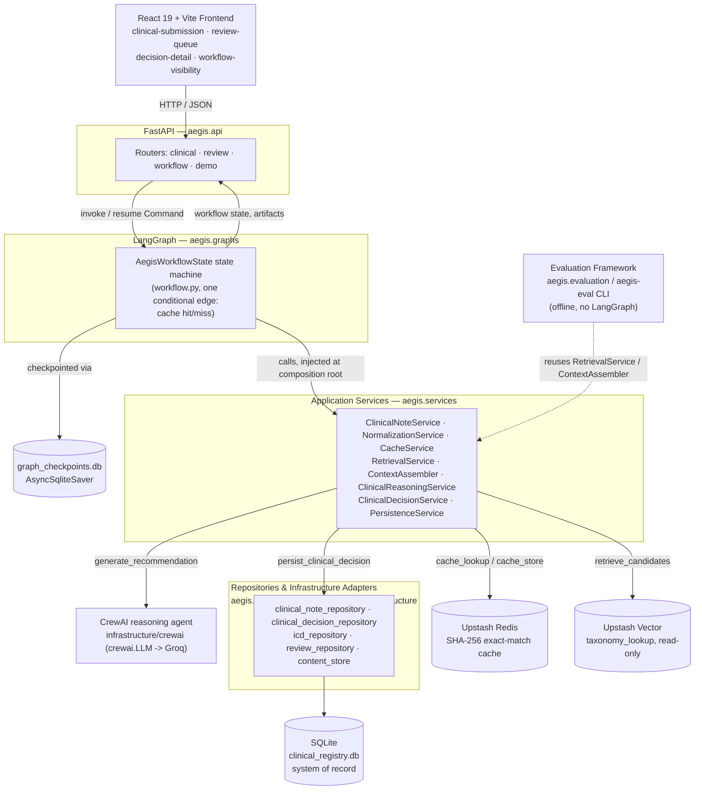
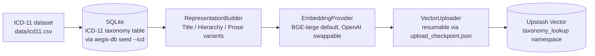
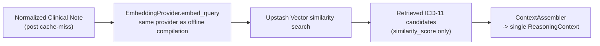

# aegis-clinical 🛡️

## Deterministic AI Orchestration for Clinical Note Structuring

`aegis-clinical` is a reference architecture demonstrating how modern AI systems can safely transform unstructured clinical notes into structured ICD-11 classifications through deterministic workflow orchestration, semantic retrieval, and human-in-the-loop validation.

Rather than relying on autonomous agent loops, the system combines explicit state-machine orchestration with bounded AI reasoning to ensure every clinical note follows a deterministic execution path from ingestion through physician approval. The repository emphasizes architectural correctness, clear data ownership, reproducible execution, and evaluation-driven development over infrastructure scale.

> **New here?** `docs/demo.md` is a guided, ~10-minute walkthrough of this exact repository — start there for a live-demo tour instead of reading top to bottom.

---

# System Architecture

Every request flows through one deterministic path, top to bottom. Upstash Vector, Upstash Redis, and CrewAI are the only components that hold non-deterministic or externally-hosted state, and each is reached exclusively through an application service — never directly from the graph or the frontend.



*Source: [`system_architecture.mmd`](system_architecture.mmd). Application services are the only layer LangGraph calls directly; services are the only layer that talks to CrewAI, repositories, Redis, or Vector — the graph itself has no infrastructure imports.*

---

# Architectural Overview

The application is intentionally organized around clear responsibility boundaries, where every major component owns exactly one concern.

### LangGraph — Deterministic Workflow Orchestration

LangGraph acts as the macro-orchestrator of the application. It defines the immutable execution topology responsible for sequencing data anonymization, semantic retrieval, AI-assisted reasoning, physician review, persistence, and workflow resumption. Human-in-the-Loop (HITL) checkpoints suspend execution safely until physician approval before allowing downstream state transitions.

### CrewAI — Bounded Clinical Reasoning

CrewAI encapsulates the clinical reasoning boundary. The v1 implementation intentionally uses a **single specialist reasoning agent** that interprets the anonymized note against the semantically retrieved ICD-11 candidates and produces a structured coding recommendation. The point of the boundary is not agent count — it is to keep reasoning cleanly separable from orchestration, so additional specialist agents (symptom extraction, negation/context analysis, temporal reasoning) can be added later without touching the LangGraph state machine. Agent execution stays isolated inside deterministic workflow boundaries and never controls application flow. See `docs/crewAI_architectural_decision.md`.

### Pydantic — Structured Validation Boundary

All AI-generated outputs pass through strongly typed **Pydantic** models before entering the application domain. This boundary converts probabilistic language-model responses into deterministic application objects while rejecting malformed, incomplete, or semantically invalid outputs before they reach persistence layers.

> **Future v2 exploration:** [PydanticAI](https://ai.pydantic.dev/) may be introduced for stronger typed agent/tool boundaries and structured agent execution. It is a declared dependency but is **not currently integrated** — v1 validation is plain Pydantic, and CrewAI remains the reasoning boundary. This is a future architectural evaluation, not a planned replacement of CrewAI.

---

# Storage Architecture

The persistence layer follows a strict separation of responsibilities.

### SQLite — System of Record

SQLite serves as the authoritative source of truth for all mutable application state, including clinical cases, physician-approved ICD-11 classifications, audit history, workflow checkpoints, optimistic versioning, and the complete ICD-11 taxonomy. Write-Ahead Logging (WAL) mode enables concurrent reads while preserving transactional consistency.

### Upstash Vector — Semantic Retrieval

A single Upstash Vector index contains a read-only `taxonomy_lookup` namespace populated with precomputed embeddings of the official ICD-11 taxonomy. The current default embedding provider is **SentenceTransformers `BAAI/bge-large-en-v1.5` (1024-dimensional)**; because embedding providers sit behind a swappable interface (`src/aegis/embeddings/`), OpenAI's `text-embedding-3-small` (1536-dimensional) can be selected instead via `EMBEDDING_*` settings without changing retrieval logic.

The vector database functions exclusively as a semantic nearest-neighbor index, returning ICD-11 identifiers during similarity search. Clinical descriptions, taxonomy metadata, and application state remain solely within SQLite, following a pointer-based architecture that avoids duplicated mutable data across storage systems.

### Upstash Redis — Deterministic Cache

Redis provides an exact-match cache keyed by the SHA-256 hash of normalized clinical notes. Previously processed notes bypass semantic retrieval and AI reasoning entirely, returning physician-approved ICD-11 classifications with zero additional embedding generation or LLM inference cost. This deterministic cache improves efficiency over time while preserving SQLite as the authoritative data source.

---

# Retrieval: Offline Compilation vs. Runtime Inference

The ICD-11 vector index and a per-request retrieval call are two independent processes that never run in the same code path — deliberately, so that reindexing the taxonomy can never block or slow down a live clinical request.

**Offline — runs only when the ICD-11 taxonomy changes:**



**Runtime — runs on every cache-miss request:**



*Sources: [`offline_indexing_pipeline.mmd`](offline_indexing_pipeline.mmd), [`runtime_retrieval_pipeline.mmd`](runtime_retrieval_pipeline.mmd). Both stages share one `EmbeddingProvider` abstraction so the two embedding spaces are always compatible — but the runtime path only ever queries the index; it never writes to it. There is no vector write-back of clinical notes in v1 (see `docs/tradeoffs_and_limitations.md`).*

---

# Clinical Processing Pipeline

Every clinical note progresses through a deterministic execution pipeline. This is the actual LangGraph state machine (`src/aegis/graphs/workflow.py`) — the only conditional edge is the cache hit/miss route; everything else is a fixed sequence of application-service calls:


*Source: [`workflow_state_machine.mmd`](workflow_state_machine.mmd), kept in lockstep with `workflow.py` — see `docs/orchestration.md` for what each node does and does not own.*

1. PHI anonymization and normalization.
2. Deterministic Redis cache lookup using the normalized note hash.
3. Semantic retrieval of candidate ICD-11 codes from Upstash Vector upon cache miss.
4. Bounded AI-assisted reasoning through a single CrewAI clinical reasoning agent, with all output validated by Pydantic schemas before it can reach persistence.
5. Human-in-the-Loop physician approval — the workflow suspends at `human_review_pending` until a decision is submitted.
6. Transactional persistence into SQLite, followed by a Redis cache update — in that order, so only durably persisted clinical truth ever becomes reusable cached knowledge.

This architecture intentionally combines deterministic state transitions with bounded AI reasoning, ensuring that probabilistic model outputs never directly control workflow execution.

---

# Repository Structure

```text
aegis-clinical/
├── data/                        # ICD-11 CSV, seeded SQLite DBs, fixtures
├── docs/                        # Reader-facing architecture docs (+ docs/history/)
├── evals/                       # AI-quality eval dataset + harness (clinical_cases.jsonl)
├── config/                      # evaluation.yaml / evaluation.production.yaml
├── runtime_domain_contracts/    # Authoritative runtime domain contracts
├── application_service_contracts/  # Authoritative application service contracts
├── frontend/                    # React 19 + Vite physician dashboard (feature-based)
├── src/
│   └── aegis/
│       ├── agents/              # CrewAI reasoning agent(s)
│       ├── api/                 # FastAPI app, routers, bootstrap composition root
│       ├── database/            # SQLite migrations, connection, repositories, CLI
│       ├── embeddings/          # Swappable embedding providers (BGE / OpenAI)
│       ├── vectorstores/        # Vector store abstraction (local / Upstash)
│       ├── indexing/            # Offline knowledge-compilation pipeline (Phase 1)
│       ├── retrieval/           # Runtime retrieval preparation (Phase 2)
│       ├── services/            # Deterministic application services
│       ├── graphs/              # LangGraph workflow, nodes, state, checkpointing
│       ├── schemas/             # Pydantic structured-output validation
│       ├── prompts/             # Versioned reasoning prompt assets
│       ├── evaluation/          # Custom deterministic eval framework (aegis-eval)
│       └── infrastructure/      # SQLite / Redis / CrewAI adapters
├── tests/                       # Deterministic software-correctness tests
├── pyproject.toml
└── README.md
```

> Note: `.github/workflows/lint_and_typecheck.yml` exists but is currently empty — CI is not yet enforcing the quality gate. The `providers/` package is an orphaned earlier LLM-provider abstraction with no current callers.

---

# Verification Strategy

The repository distinguishes functional correctness from AI quality evaluation.

## Unit Tests

Verify deterministic business logic, schema validation, state transitions, and utility functions independent of external AI providers.

## Integration Tests

Validate complete workflow execution across orchestration, persistence, checkpointing, and Human-in-the-Loop interactions using synthetic datasets.

## Evaluation Framework

AI-quality evaluation is maintained independently from traditional software tests. AEGIS ships a **custom deterministic evaluation framework** (`src/aegis/evaluation/`, CLI: `aegis-eval`, dataset: `evals/clinical_cases.jsonl`, config-driven via `config/evaluation.yaml`) that reuses the same real application services the production workflow uses. It measures two boundaries:

- **Retrieval quality** — Recall@K, Hit Rate@K, and Mean Reciprocal Rank against a curated ICD-11 fixture (`local`) or the real Upstash Vector index (`production`).
- **Reasoning quality** — deterministic scoring only (no LLM-as-judge yet): schema validity, expected-code alignment, and evidence grounding.

Every run writes reproducible, provenance-stamped reports (git commit, dataset hash, config hash, model/provider) under `.artifacts/evaluations/`. See `docs/testing_and_evaluations.md` for the full methodology and the deferred roadmap (LLM-as-judge, Braintrust experiment tracking — both future, not yet integrated).

---

# Running the Demo (Real Retrieval, Minimal Credentials)

> For a guided, narrated walkthrough of everything below (plus the frontend and the evaluation CLI), see `docs/demo.md`.

A complete, reproducible run of the clinical pipeline — submission, AI-assisted recommendation, physician review, and persisted decision — is available as a single command:

```bash
make db-init && make db-seed-icd   # once, before the first run
make demo
# equivalent to: AEGIS_PROFILE=demo uv run python scripts/demo_e2e.py
```

This drives the real FastAPI application (`aegis.api.main.app`) through its HTTP boundary using FastAPI's `TestClient` — the real lifespan, the real LangGraph workflow, and the real interrupt/resume suspension all run exactly as they would under `make dev-backend`, against the same composition root (`aegis/api/bootstrap.py`) and the same real, locally-seeded `data/clinical_registry.db` that `make demo-server` below uses. Under `AEGIS_PROFILE=demo`, embedding and Upstash Vector retrieval stay real (see "Running the Demo Server" below for why); only the cache, reasoning, and content-repository collaborators are deterministic in-memory substitutes. That means `make demo` needs `UPSTASH_VECTOR_REST_URL`/`UPSTASH_VECTOR_REST_TOKEN` and the `EMBEDDING_*` settings in `.env`, but not `GROQ_API_KEY` or Upstash Redis credentials. Because retrieval is real, the physician's decision in the script is read back from whatever the AI actually recommended, not a hardcoded ICD code.

A second, credential-free scenario is expressed as an automated test in `tests/integration/test_clinical_pipeline.py` (fake embedding/retrieval too, ephemeral SQLite, no `.env` needed), including the cache-hit path on a repeat submission:

```bash
uv run pytest tests/integration/test_clinical_pipeline.py -v
```

`make integration` runs the identical script (`scripts/integration_e2e.py`, sharing its workflow logic with `scripts/demo_e2e.py` via `scripts/e2e_common.py`) under `AEGIS_PROFILE=integration` instead: real Redis-backed cache and real CrewAI/Groq reasoning replace demo's in-memory ones, so it also needs `GROQ_API_KEY` and the Upstash Redis credentials. Its purpose is verifying that the full external infrastructure wiring works, not exercising different application logic.

See `docs/tradeoffs_and_limitations.md` — "Live-Credential Content Seeding Gap" — for why both `make demo` and `make integration` submit one of a fixed set of pre-seeded sample notes rather than arbitrary freshly-typed text.

---

# Running the Demo Server (React Frontend, One Real Credential)

The script above is a fully offline, zero-credential *reproduction* of the pipeline. There is a second, distinct way to run the demo: a real, long-lived FastAPI server the React frontend (`frontend/`) talks to over HTTP, which is what a live interview walkthrough actually uses.

It is the exact same application — same FastAPI app, same routers, same LangGraph workflow, same application services — started with one configuration value changed:

```bash
AEGIS_PROFILE=demo make demo-server
# equivalent to: AEGIS_PROFILE=demo uv run uvicorn aegis.api.main:app --app-dir src --reload --port 9000
```

`AEGIS_PROFILE=demo` changes only which collaborators `aegis/api/bootstrap.py` (the composition root) assembles:

- **Real, unchanged:** SQLite persistence, the full ICD-11 taxonomy, PHI anonymization/normalization, the embedding provider, and Upstash Vector retrieval — this profile queries the actual ~15,000-vector BGE-large index the offline indexing pipeline built, so the retrieval results a reviewer sees are genuinely real.
- **Deterministic substitutes:** the cache (in-memory instead of Upstash Redis), clinical reasoning (a deterministic adapter that recommends the top real retrieval candidate instead of calling Groq/CrewAI — see `DeterministicTopCandidateReasoningProvider`), and the content repository (in-memory, pre-seeded with a fixed set of sample notes, for the same reason described below).

This means the server needs only `UPSTASH_VECTOR_REST_URL`/`UPSTASH_VECTOR_REST_TOKEN` and the `EMBEDDING_*` settings from `.env` — no `GROQ_API_KEY` or Upstash Redis credentials.

Submissions in this profile must use one of the pre-seeded `content_reference` values in `aegis.api.bootstrap.DEMO_SAMPLE_NOTES` (the frontend is expected to offer these as selectable sample cases), not arbitrary freshly-typed text — see "Live-Credential Content Seeding Gap" below for why.

---

# Running Demo-Local (Zero Credentials)

`demo` above still needs Upstash Vector and `EMBEDDING_*` credentials — real semantic retrieval against a live external index is the point of that profile. `AEGIS_PROFILE=demo-local` is a third profile for the case where a reviewer wants to run the app with **no credentials of any kind**: not `GROQ_API_KEY`, not the Upstash Redis pair, not `UPSTASH_VECTOR_REST_URL`/`UPSTASH_VECTOR_REST_TOKEN`, not `OPENAI_API_KEY` — no `.env` file at all.

It is, again, the exact same application, started with the same configuration value changed one step further:

```bash
uv sync
make db-init && make db-seed-icd
make demo-local
# equivalent to: AEGIS_PROFILE=demo-local uv run uvicorn aegis.api.main:app --app-dir src --reload --port 9000
```

`AEGIS_PROFILE=demo-local` reuses the same in-memory cache, reasoning, and content-repository substitutes as `demo`, and additionally replaces retrieval itself: instead of querying a live Upstash Vector index, `aegis.indexing.local_compiler` compiles the real ~15,471-row ICD-11 taxonomy (the same rows `make db-seed-icd` seeds, not a toy fixture) through the same offline `IndexingPipeline`/`RepresentationBuilder` used to build the real index, embeds it locally with the same `SentenceTransformers` model (`BAAI/bge-large-en-v1.5`) the other profiles use by default, and serves queries from an in-memory `LocalVectorQueryProvider` running brute-force cosine similarity. Retrieval is therefore still real semantic search over the real taxonomy — never a hardcoded ICD code — just against a local index instead of Upstash's.

**First run compiles the local index; every run after that loads it from a cache.** Embedding ~15k rows on CPU is a one-time cost of several minutes; the compiled result is persisted as a generated artifact under `.artifacts/local_vector_index/` (already `.gitignore`d, never committed), fingerprinted by a manifest (taxonomy content hash, row count, embedding model, dimensions) so any change to the taxonomy or embedding configuration triggers a fresh compile rather than silently serving a stale index. `--reload` restarts and subsequent `make demo-local` invocations load that cached artifact in seconds.

`demo-local` is a reviewer-convenience path for exercising the architecture with nothing installed beyond `uv sync`, not a claim that its retrieval quality or performance matches production — the brute-force local query path is appropriate for a single reviewer's local index, not a production-scale deployment. See `docs/demo.md` for the full walkthrough and the exact dependency-inversion point it demonstrates: external infrastructure (Upstash Vector, Redis, Groq) can be swapped at the composition root (`aegis/api/bootstrap.py`) without the LangGraph workflow, application services, or domain contracts changing at all.

---

# Engineering Principles

The architecture is guided by several core design principles:

* Deterministic workflow execution over autonomous agent control.
* Single source of truth for all mutable application state.
* Explicit separation between orchestration, reasoning, validation, and persistence.
* Pointer-based semantic retrieval without duplicated mutable metadata.
* Evaluation-driven AI development with reproducible benchmarks.
* Minimal infrastructure complexity while preserving clear production evolution paths.
