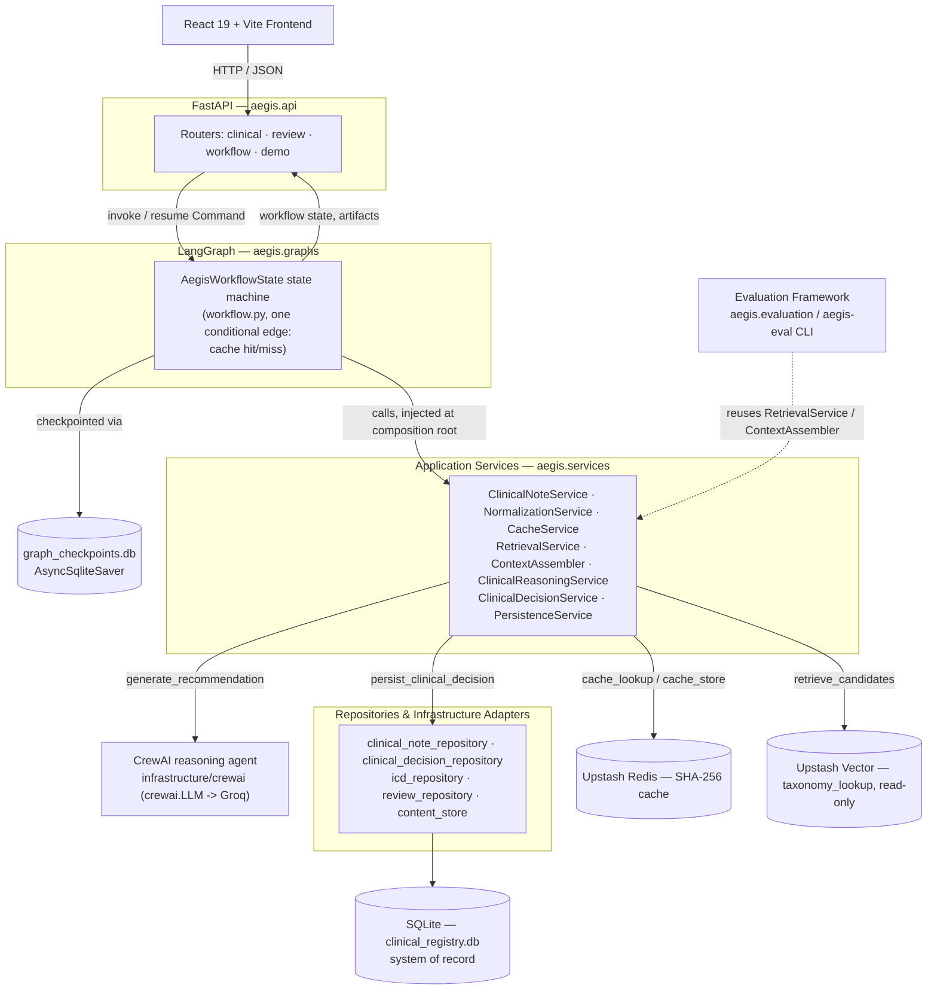

# AEGIS Clinical — Architecture Overview

> **v1 implementation.** Reader-facing overview. The authoritative design is the runtime
> domain contracts (`runtime_domain_contracts/`, `domain_contract_finalized.md`) and
> application service contracts (`application_service_contracts/`,
> `application_service_finalized.md`) — this document links up to them rather than
> restating them. A broader narrative lives in `system_architecture_v2.md`.

## The defining principle

> Deterministic systems own workflow execution. Probabilistic systems (LLMs) contribute
> bounded reasoning inside explicit guardrails. **The application governs the AI; the AI
> never owns the application.**

Consequences enforced in code: reasoning agents never touch infrastructure (they receive
a `ReasoningContext` and return structured output); model output never drives control
flow (routing is deterministic code); SQLite is the single system of record, with Redis
and Upstash Vector as derived layers.

## Three subsystems

1. **Offline knowledge compilation** (`src/aegis/indexing/`, `embeddings/`,
   `vectorstores/`, `jobs/`). Deterministic, reproducible, runs only when the ICD-11
   taxonomy changes: SQLite taxonomy → `RepresentationBuilder` → `EmbeddingProvider` →
   `VectorUploader` → Upstash Vector (resumable via checkpoint).
2. **Deterministic runtime preparation** (`src/aegis/retrieval/`, early graph nodes). No
   LLMs: anonymize → normalize → SHA-256 → Redis exact-match lookup → on miss, embed +
   query Upstash Vector → candidate ranking → assemble a single `ReasoningContext`.
3. **Bounded AI reasoning** (`src/aegis/agents/`, `schemas/`, `prompts/`, `graphs/`). A
   single CrewAI clinical-reasoning agent produces a `CodingRecommendation` (choosing only
   from retrieved candidates); Pydantic validates output; physician review gates
   persistence; results are written transactionally to SQLite and Redis is updated.

Subsystem 1 (offline) and subsystems 2–3 (runtime) never share a code path — see
`../offline_indexing_pipeline.mmd` vs. `../runtime_retrieval_pipeline.mmd`, both embedded
side by side in the README's "Retrieval: Offline Compilation vs. Runtime Inference"
section.

See `docs/orchestration.md` for the wired LangGraph workflow and
`docs/clinical_note_ingestion_flow.md` for the runtime data flow.

## Runtime profiles

The three subsystems above, and every diagram below, describe the *application* — which is
identical regardless of how it's run. What varies is which concrete infrastructure adapter
the composition root (`api/bootstrap.py`) wires up for a handful of boundaries (cache,
reasoning, content-repository, and, for one profile, vector retrieval), selected by a single
`AEGIS_PROFILE` value: `production` | `demo` | `demo-local` | `integration`. This is a
dependency-injection switch, not a code fork — see CLAUDE.md's "Runtime profiles" section for
the per-profile comparison, the README's "Runtime Execution Profiles" section for how to run
each one, and `docs/adr/0002-runtime-profile-architecture.md` /
`docs/adr/0003-local-demo-execution-strategy.md` for the reasoning behind the mechanism and
behind `demo-local` specifically.

## System architecture (layers)



*Source: `../system_architecture.mmd`, also embedded in the README's "System Architecture"
section. The graph layer has no infrastructure imports of its own — every external system
is reached through an injected application service.*

## Repository structure (real)

```text
src/aegis/
├── agents/          # CrewAI reasoning agent(s)
├── api/             # FastAPI app, routers, bootstrap composition root
├── database/        # SQLite migrations (0001–0012), connection, repositories, CLI
├── embeddings/      # Swappable embedding providers (BGE default / OpenAI)
├── vectorstores/    # Vector store abstraction (local / Upstash)
├── indexing/        # Offline knowledge-compilation pipeline (subsystem 1)
├── retrieval/       # Runtime retrieval preparation (subsystem 2)
├── services/        # Deterministic application services
├── graphs/          # LangGraph workflow, nodes, state, checkpoint serde
├── schemas/         # Pydantic structured-output validation
├── prompts/         # Versioned reasoning prompt assets
├── evaluation/      # Custom deterministic eval framework (aegis-eval)
├── infrastructure/  # SQLite / Redis / CrewAI adapters
└── jobs/            # Offline batch orchestration
```

Notes on the current tree:
- `.github/workflows/lint_and_typecheck.yml` exists but is **empty** — CI is not yet
  enforcing the quality gate.
- The root-level `providers/` package is an orphaned earlier LLM-provider abstraction
  with no current callers; LLM access for CrewAI goes through `crewai.LLM`
  (`infrastructure/crewai/reasoning_provider.py`).

## Storage ownership

| Store          | Responsibility                                   | Authoritative |
| -------------- | ------------------------------------------------ | ------------- |
| SQLite         | Clinical registry + ICD-11 taxonomy (system of record) | **Yes** |
| Upstash Vector | Semantic nearest-neighbor retrieval (ids only)   | No (derived)  |
| Upstash Redis  | Deterministic SHA-256 exact-match cache          | No (derived)  |

There are two SQLite databases: the clinical registry (`data/clinical_registry.db`) and
the LangGraph checkpoint store (`data/graph_checkpoints.db`, via `AsyncSqliteSaver`). See
`src/aegis/database/how_database_layer_works_exactly.md`.

## Observability (v1)

Workflow visibility is provided by workflow-state exposure through
`GET /api/v1/workflows/{workflow_id}` and the React workflow-stage timeline / review
queue. There is **no OpenTelemetry instrumentation** in v1 — see the roadmap below.

## Future v2 roadmap (not implemented)

Documented as direction, not current capability:

- **PydanticAI** — typed agent/tool boundaries and structured agent execution (a declared
  dependency, not integrated; an evaluation, not a CrewAI replacement).
- **Braintrust** — evaluation experiment tracking, dataset versioning, richer eval
  workflows, human feedback loops, and LLM-assisted judging.
- **OpenTelemetry** — distributed tracing, span-level visibility, and production telemetry
  exported via OTLP to a backend such as Jaeger / Grafana Tempo / OpenObserve.
- Hybrid / multi-representation retrieval, LLM-assisted re-ranking, confidence-gated
  auto-archiving, AI-assisted clinical trial matching, and institutional semantic memory.
