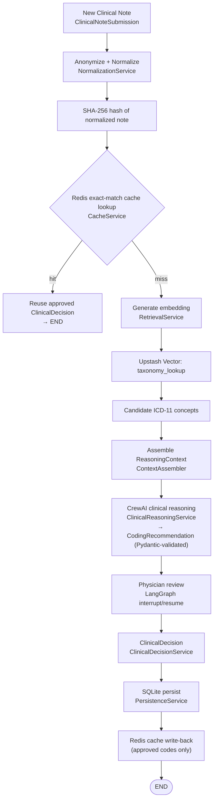

# AEGIS Clinical — Clinical Note Ingestion Flow

> **v1 implementation.** This describes the flow as wired in `src/aegis/graphs/workflow.py`
> and the application services it calls. An earlier, more ambitious design (semantic Tier-2
> cache, LLM edge-guard anonymization, vector write-back) was drafted but **not built**;
> it is preserved, clearly labeled, in "Historical / future design" at the end.

## Current flow

*Source: `../workflow_state_machine.mmd` / `../runtime_retrieval_pipeline.mmd` capture the same
flow at the service-name level and are the versions embedded in the README.*

## Phase notes (as built)

**Anonymization + normalization.** Deterministic PHI anonymization and text
normalization produce a `NormalizedClinicalNote`. Two normalization concerns exist: a
natural-prose form feeds embedding, and an aggressive form (lowercase, whitespace/
punctuation stripping, stop-word removal, token sort) feeds the cache hash. Stop-word
removal belongs only to the cache path, never before embedding.

**Cache lookup (single tier).** The cache is a **single-tier, exact-match** lookup:
SHA-256 of the normalized note → Redis. A hit returns the previously physician-approved
codes with zero embedding or LLM cost. There is **no semantic (Tier-2) similarity cache**
in v1.

**Retrieval.** On a miss, the note is embedded and Upstash Vector returns the nearest
ICD-11 ids (pointer-based; descriptions stay in SQLite). Retrieval provides evidence
only — it does not diagnose or rank clinical correctness.

**Reasoning.** `ContextAssembler` builds a single `ReasoningContext`; the CrewAI agent may
only select from the retrieved candidates and returns a `CodingRecommendation` validated
by Pydantic schemas. The recommendation is never persisted as truth and never enters the
cache.

**Review and persistence.** The workflow suspends for physician review. The approved
`ClinicalDecision` is the only artifact that triggers SQLite persistence and the Redis
write-back. **Only approved ICD codes** are written to Redis — not recommendations,
evidence, reasoning, or confidence. **There is no vector write-back** of clinical notes in
v1 (the vector index stays a read-only ICD taxonomy index).

## Historical / future design (drafted, not implemented)

The original ingestion spec described a substantially more elaborate pipeline. These ideas
are retained as **future-exploration / historical design** and are **not present in the
code today**:

- **Tier-2 semantic cache.** A cosine-similarity (≥ 0.985) lookup against a vector cache of
  prior cases, gated by a deterministic "entity alignment / negation guard" (checking for
  mismatched negation modifiers) before reusing a semantic match. v1 has exact-match Redis
  only.
- **LLM edge-guard anonymization.** A "PydanticAI Edge Guard" using a small model to strip
  non-structural prose identifiers, layered on Microsoft Presidio local NER. v1
  anonymization is deterministic; PydanticAI is not integrated (see the v2 roadmap in
  `docs/architecture.md`).
- **Vector write-back.** Upserting the approved case's embedding + code metadata into a
  vector index after sign-off, to grow institutional semantic memory. Deferred — see
  `docs/tradeoffs_and_limitations.md` ("Deferred Architectural Evolution: Semantic
  Institutional Memory").

These belong to the v2 roadmap and should not be read as describing current behavior.
