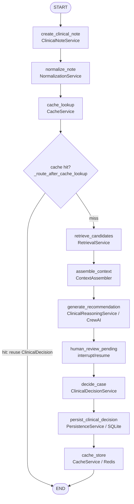

# AEGIS Clinical — Orchestration (LangGraph)

> **v1 implementation.** The workflow described here is wired end to end in
> `src/aegis/graphs/workflow.py`. LangGraph is the macro state machine; it coordinates the
> deterministic and probabilistic application services but owns **no** clinical business
> logic.

## What LangGraph owns (and does not)

LangGraph owns execution order, the deterministic cache-hit/miss routing decision, the
interrupt/resume suspension point ahead of physician review, checkpointing, and state
recovery. It does **not** own normalization rules, retrieval algorithms, context-assembly
policy, reasoning, approval classification, or persistence/cache mechanics — each of those
is owned by the application service the corresponding node calls. A node resembles
`normalize_note → NormalizationService.normalize()`, keeping the graph layer thin.

## The wired graph

Shared state: `AegisWorkflowState` (`src/aegis/graphs/state.py`), consolidated into
domain-artifact fields.

*Source: `../workflow_state_machine.mmd`, also embedded in the README's "Clinical Processing
Pipeline" section.*

## Conditional routing

The **only** conditional edge in v1 is `_route_after_cache_lookup`: a cache hit ends the
workflow (the previously physician-approved `ClinicalDecision` is reused with zero
embedding or LLM cost), a cache miss routes unconditionally into the retrieval →
reasoning → review path.

> **Future v2:** confidence-based routing that auto-archives high-confidence cases instead
> of always requiring human review is documented in `domain_contract_finalized.md`
> ("Should AI auto-approve high confidence cases?"). It is **not implemented** — do not
> assume it exists.

## Human-in-the-loop suspension

`human_review_pending` is a LangGraph interrupt/resume boundary with no backing service.
The workflow suspends there; the physician's decision is submitted via
`POST /api/v1/reviews/{thread_id}/decision`, which reads case/recommendation identity out
of the suspended state (never trusted from the request), builds a
`PhysicianDecisionSubmission`, and resumes with `Command(resume=...)`. The graph — not the
router — classifies each code's disposition in `decide_case`.

## Checkpointing & concurrency

Checkpointing uses `AsyncSqliteSaver` against `data/graph_checkpoints.db`, set up in the
FastAPI lifespan (`src/aegis/api/main.py`) with an explicit checkpoint serializer
(`graphs/checkpoint_serde.py`) that allow-lists the domain objects crossing the
serialization boundary. Concurrency uses optimistic locking via a `version` column
(`graphs/optimistic_locking.py`); conflicting upserts raise on version collision.

This is a separate SQLite database from the clinical registry (system of record) — the two
are deliberately decoupled so either can be reset without destroying the other.
